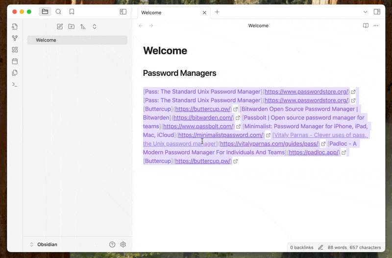

# Link Formatter

Formats a block of links into a clean markdown list in Obsidian.

Here I'm pasting links from Firefox bookmarks and formatting them.

Once installed select the links you want to format and search for `Link Formatter: Format links to unordered list` in the command pallet.

Once you select that the links will be formatted. You can also setup a hotkey for this command.